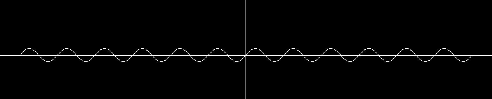

# 傅里叶变换


**时域**是惟一客观存在的域，**频域**是一种遵循特定规则的数学范畴。

任何周期函数都可以看作是不同振幅，不同相位**正弦波**的叠加。

傅里叶变换将**时域**和**频域**连接了起来。

用来绘制三角函数图像的函数(`glut` of `OpenGL`)：
```C++
#include <GL/glut.h>
#include <cmath>

#define X_begin  3.14f
#define X_end   -3.14f
#define Y_begin  1.f
#define Y_end   -1.f

void draw_axes() {
    glBegin(GL_LINES);
    glVertex2f(X_begin, 0.f);    
    glVertex2f(X_end, 0.f);     
    glEnd();

    glBegin(GL_LINES);
    glVertex2f(0.f, Y_begin);      
    glVertex2f(0.f, Y_end);
    glEnd();
}

void draw_sine() {
    glBegin(GL_LINE_STRIP); 
    for (float x = -3.14f; x <= 3.14f; x += 0.01f) {
        float y = sin(x); 
        glVertex2f(x, y);  
    }
    glEnd();
}

// 初始化
void initOpenGL() {
    glClearColor(0.0f, 0.0f, 0.0f, 1.0f);    
    glClear(GL_COLOR_BUFFER_BIT);            
    glLoadIdentity();                        
    glMatrixMode(GL_PROJECTION);             
    glLoadIdentity();                        
    gluOrtho2D( X_begin
              , X_end
              , Y_begin
              , Y_end
              ); // 二维正交投影
}

// 渲染
void display() {
    glClear(GL_COLOR_BUFFER_BIT); 

    draw_axes();
    draw_sine();             
 
    glFlush();                    
    glutSwapBuffers();
}

int main(int argc, char** argv) {
    glutInit(&argc, argv);
    glutInitDisplayMode(GLUT_DOUBLE | GLUT_RGB); 
    glutInitWindowSize(500, 500);               
    glutCreateWindow("Sine Wave");              
    initOpenGL();                               
    glutDisplayFunc(display);                   
    glutMainLoop();                             

    return 0;
}

```
$$
f(x) = sin(x)
$$
图像：


$$
f(x) = sin(x) + 0.333sin(3x)
$$

图像：


$$
f(x) = \frac{\sin(x)}{1} + \frac{\sin(3x)}{3} + \frac{sin(5x)}{5} 
$$

图像：


$$
f(x) = \frac{\sin(x)}{1} + \frac{\sin(3x)}{3} + \frac{\sin(5x)}{5} + \frac{\sin(7x)}{7}
$$

图像：


以此类推其他的正弦波叠加的情况：
$$
f(x) = \sum_{n=1}^{\infin} \frac{\sin(nx)}{n}
$$
当$n$趋于无穷时，$f(x)$的图像可近似看为矩形波。


组成图像的各个子波：

$$
f(x) = \frac{sin(x)}{1}
$$

$$
f(x) = \frac{sin(3x)}{3}
$$

$$
f(x)  = \frac{sin(5x)}{5}
$$


当$n$趋于无穷时，其图像等价于$y = 0$。

其中$T=\frac{2{\pi}}{n}$,${f=\frac{1}{T}}$

不同频率的正弦波组成频率分量。

$w=2\pi f$

时域的基本单位为`1秒`。

如果将一个角频率为$w_{0}$的正弦波$sin(w_{0}t)$看作基，那么频域的基本单位为$w_{0}$。

${sin(0t)}$是一个周期无限长的正弦波，对于频域而言，$0$频率也被称为直流分量，在傅里叶级数的叠加中，其仅仅对波形的相对于数轴的上下位置有影响而不影响波形。


欧拉公式
$$e^{i\theta} = \cos(\theta) + i\sin(\theta)$$

欧拉恒等式($\theta = \pi$时)
$$
e^{i\theta} + 1 = 0
$$

